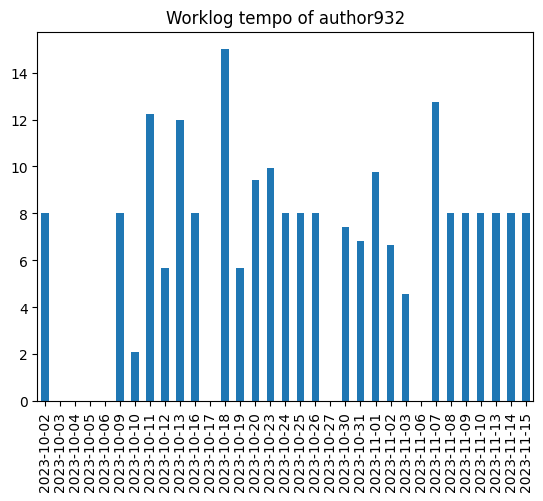

# tempo-performance (Work In Progress)

Research on employee productivity pattern based on their tempo worklog analysis.

## Context

The main purpose of this project is to determine a **productivity pattern** of IT employees using data from project 
tracking software such as Atlassian Jira. Unlike most common representation of employee's worklog as a table of tasks
and hours logged on each of those on specific dates, we define a **physical worklog** which consists of sums of hours 
logged by employee during specific dates physically. Exactly in this worklog representation we want to find a pattern 
of higher productive employees and then spread it to others to maximize general performance.

This physical worklog can be perfectly represented by time series:

which allows us to extract features from it using common statistical approaches.
We then choose metrics to evaluate employees productivity and build models to be able to restore metric value by 
features.

This research was based on data of company N. in 5 quarters (July 2023 - September 2024) about 700+ employees.

Project code is full Python 3.9 and Jupyter Notebook for better visual support.

## Features

* Utilities for data masking and aggregation
* Time series feature engineering
* Target metrics analysis
* Regression models comparison & evaluation
* Feature-based clustering
* Multiclass classification 

## Structure

* [`utils`](utils) for loading, masking and aggregation of data
* [`reports`](reports) for creating physical worklog-based visual reports.
* [`notebooks`](notebooks) for detailed analysis of metrics and models in Jupyter Notebooks.
* [`models`](models) for feature engineering and dataset creation.
* [`metrics`](metrics) for metrics value computation.
* [`data_sample`](data_sample) for example of data used in research (full data can not be shared).

## Requirements

See [`requirements.txt`](requirements.txt).

## References

* T. D. N. Vuong, L. T. Nguyen (2022) The Key Strategies for Measuring Employee Performance in Companies: 
A Systematic Review.
* Box, G. E. P.; Jenkins, G. M.; Reinsel, G. C. (1994). Time Series Analysis: Forecasting and Control (3rd ed.). 
Upper Saddle River, NJ: Prentice–Hall. ISBN 978-0130607744.
* Hayes M. H. Statistical digital signal processing and modeling. — John Wiley & Sons, 2009.
* P. Welch, “The use of the fast Fourier transform for the estimation of power spectra: A method based on time 
averaging over short, modified periodograms”, IEEE Trans. Audio Electroacoust. vol. 15, pp. 70-73, 1967.
* MacKinnon, J.G. 2010. Critical Values for Cointegration Tests. Queen's University, Dept of Economics, 
Working Papers.
* Kwiatkowski, D., Phillips, P.C.B., Schmidt, P., & Shin, Y. (1992). Testing the null hypothesis of stationarity 
against the alternative of a unit root. Journal of Econometrics, 54: 159-178.
* Lütkepohl, H. 2005. New Introduction to Multiple Time Series Analysis. Springer.
* Chow, Gregory C. Tests of Equality Between Sets of Coefficients in Two Linear Regressions — 1960. — Vol. 28. — P. 
591—605.

# License

[MIT License](LICENSE)